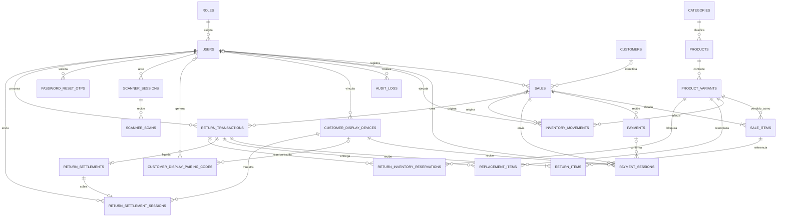

# Relaciones de clases y tablas de la base de datos TiendaKadosh

> El siguiente cuadro describe todas las relaciones entre clases (tablas) de la base de datos TiendaKadosh, incluyendo cardinalidad, claves foraneas y reglas de integridad.

## 1. Identificacion del documento

| Campo | Valor |
|---|---|
| Sistema | Kadosh POS |
| Nombre logico de la base de datos | TiendaKadosh |
| Motor real | PostgreSQL administrado en Supabase |
| Esquema | `public` |
| ORM | SQLAlchemy 2.0 |
| Clave primaria estandar | `id UUID` |
| Fuentes verificadas | `database/001_init_schema.sql`, migraciones `003` a `017` y modelos de `apps/api/app/models` |
| Fecha de revision | 18 de julio de 2026 |

Este documento describe el esquema efectivo despues de aplicar todas las migraciones. Cuando el esquema inicial y una migracion difieren, prevalece la migracion mas reciente.

## 2. Leyenda de cardinalidad

| Simbolo | Significado |
|---|---|
| `1` | Una fila obligatoria |
| `0..1` | Ninguna o una fila |
| `1..N` | Una o muchas filas |
| `0..N` | Ninguna o muchas filas |
| FK | Clave foranea aplicada por PostgreSQL |
| Relacion logica | Asociacion usada por la aplicacion, pero no protegida por FK |

La cardinalidad se interpreta desde la tabla padre hacia la tabla hija. Por ejemplo, `roles 1 -> 0..N users` significa que un rol puede no tener usuarios o tener muchos, mientras cada usuario debe tener exactamente un rol.

## 3. Inventario de tablas

| N. | Tabla | Dominio | Proposito principal |
|---:|---|---|---|
| 1 | `roles` | Seguridad | Roles internos del sistema |
| 2 | `users` | Seguridad | Administradores, vendedores y cajeros |
| 3 | `customers` | Clientes | Datos de clientes identificados |
| 4 | `categories` | Catalogo | Clasificacion administrable de productos |
| 5 | `products` | Catalogo | Producto comercial base |
| 6 | `product_variants` | Catalogo e inventario | SKU vendible por talla y color |
| 7 | `sales` | Ventas | Cabecera de la operacion comercial |
| 8 | `sale_items` | Ventas | Detalle historico de productos vendidos |
| 9 | `payments` | Pagos | Cobros manuales o procesados por proveedor |
| 10 | `payment_sessions` | Pagos y tablet | Sesiones de cobro de ventas enviadas al cliente |
| 11 | `inventory_movements` | Inventario | Kardex de entradas, salidas y ajustes |
| 12 | `audit_logs` | Auditoria | Evidencia de acciones sensibles |
| 13 | `customer_display_devices` | Dispositivos | Tablets vinculadas y autorizadas |
| 14 | `customer_display_pairing_codes` | Dispositivos | Codigos temporales de vinculacion |
| 15 | `scanner_sessions` | Scanner | Sesiones de celular para productos o boletas |
| 16 | `scanner_scans` | Scanner | Lecturas recibidas desde el celular |
| 17 | `password_reset_otps` | Seguridad | Codigos OTP de recuperacion de contrasena |
| 18 | `return_transactions` | Postventa | Cabecera de cambios y devoluciones |
| 19 | `return_items` | Postventa | Productos recibidos desde la venta original |
| 20 | `replacement_items` | Postventa | Productos entregados como reemplazo |
| 21 | `return_settlements` | Postventa y pagos | Liquidacion economica de una operacion |
| 22 | `return_settlement_sessions` | Postventa y tablet | Cobro Culqi de una diferencia |
| 23 | `return_inventory_reservations` | Postventa e inventario | Reserva temporal de reemplazos |

## 4. Cuadro maestro de relaciones

| N. | Tabla padre | Tabla hija | Cardinalidad | FK en tabla hija | Nulable | `ON UPDATE` | `ON DELETE` | Regla de integridad |
|---:|---|---|---|---|---|---|---|---|
| 1 | `roles` | `users` | `1 -> 0..N` | `users.role_id -> roles.id` | No | `CASCADE` | `RESTRICT` | Todo usuario requiere un rol; un rol usado no puede eliminarse |
| 2 | `users` | `sales` | `1 -> 0..N` | `sales.seller_id -> users.id` | No | `CASCADE` | `RESTRICT` | Toda venta conserva al vendedor responsable |
| 3 | `customers` | `sales` | `1 -> 0..N` | `sales.customer_id -> customers.id` | Si | `CASCADE` | `SET NULL` | Admite venta a publico general y preserva la venta si se elimina el cliente |
| 4 | `categories` | `products` | `1 -> 0..N` | `products.category_id -> categories.id` | No | `CASCADE` | `RESTRICT` | Todo producto pertenece a una categoria valida |
| 5 | `products` | `product_variants` | `1 -> 0..N` | `product_variants.product_id -> products.id` | No | `CASCADE` | `RESTRICT` | Una variante no existe sin producto base |
| 6 | `sales` | `sale_items` | `1 -> 1..N` funcional | `sale_items.sale_id -> sales.id` | No | `CASCADE` | `CASCADE` | El detalle se elimina solo si se elimina fisicamente la venta |
| 7 | `product_variants` | `sale_items` | `1 -> 0..N` | `sale_items.product_variant_id -> product_variants.id` | No | `CASCADE` | `RESTRICT` | Una variante vendida no puede eliminarse y romper historia |
| 8 | `sales` | `payments` | `1 -> 0..N` | `payments.sale_id -> sales.id` | No | `CASCADE` | `RESTRICT` | Una venta con pagos no puede eliminarse fisicamente |
| 9 | `sales` | `payment_sessions` | `1 -> 0..N` | `payment_sessions.sale_id -> sales.id` | No | `CASCADE` | `CASCADE` | Las sesiones pertenecen exclusivamente a una venta |
| 10 | `payments` | `payment_sessions` | `1 -> 0..N` | `payment_sessions.payment_id -> payments.id` | Si | `CASCADE` | `SET NULL` | La sesion puede crearse antes de existir el pago confirmado |
| 11 | `users` | `payment_sessions` | `1 -> 0..N` | `payment_sessions.seller_id -> users.id` | No | `CASCADE` | `RESTRICT` | Toda sesion conserva al operador que la creo |
| 12 | `product_variants` | `inventory_movements` | `1 -> 0..N` | `inventory_movements.product_variant_id -> product_variants.id` | No | `CASCADE` | `RESTRICT` | No se elimina una variante con kardex historico |
| 13 | `users` | `inventory_movements` | `1 -> 0..N` | `inventory_movements.user_id -> users.id` | Si | `CASCADE` | `SET NULL` | El movimiento permanece aunque el usuario sea eliminado |
| 14 | `sales` | `inventory_movements` | `1 -> 0..N` | `inventory_movements.sale_id -> sales.id` | Si | `CASCADE` | `SET NULL` | Movimientos manuales pueden no tener venta; el kardex se conserva |
| 15 | `users` | `audit_logs` | `1 -> 0..N` | `audit_logs.user_id -> users.id` | Si | `CASCADE` | `SET NULL` | La auditoria permanece aun si desaparece el usuario |
| 16 | `users` | `customer_display_devices` | `1 -> 0..N` | `customer_display_devices.paired_by_user_id -> users.id` | Si | No declarado | `SET NULL` | Se conserva la tablet aunque se elimine quien la vinculo |
| 17 | `users` | `customer_display_pairing_codes` | `1 -> 0..N` | `customer_display_pairing_codes.created_by_user_id -> users.id` | Si | No declarado | `SET NULL` | El codigo conserva trazabilidad temporal sin bloquear al usuario |
| 18 | `customer_display_devices` | `customer_display_pairing_codes` | `1 -> 0..N` | `customer_display_pairing_codes.paired_device_id -> customer_display_devices.id` | Si | No declarado | `SET NULL` | Un codigo usado puede registrar la tablet resultante |
| 19 | `users` | `scanner_sessions` | `1 -> 0..N` | `scanner_sessions.seller_id -> users.id` | No | `CASCADE` | `RESTRICT` | Toda sesion de scanner tiene operador responsable |
| 20 | `scanner_sessions` | `scanner_scans` | `1 -> 0..N` | `scanner_scans.scanner_session_id -> scanner_sessions.id` | No | `CASCADE` | `CASCADE` | Al eliminar una sesion se eliminan sus lecturas temporales |
| 21 | `users` | `password_reset_otps` | `1 -> 0..N` | `password_reset_otps.user_id -> users.id` | No | `CASCADE` | `CASCADE` | Los OTP no tienen sentido sin el usuario |
| 22 | `sales` | `return_transactions` | `1 -> 0..N` | `return_transactions.original_sale_id -> sales.id` | No | `CASCADE` | `RESTRICT` | Un cambio siempre conserva la venta original |
| 23 | `users` | `return_transactions` | `1 -> 0..N` | `return_transactions.processed_by_id -> users.id` | No | `CASCADE` | `RESTRICT` | Toda operacion postventa tiene operador responsable |
| 24 | `return_transactions` | `return_items` | `1 -> 1..N` funcional | `return_items.return_transaction_id -> return_transactions.id` | No | `CASCADE` | `CASCADE` | Los items recibidos forman parte de la transaccion |
| 25 | `sale_items` | `return_items` | `1 -> 0..N` | `return_items.sale_item_id -> sale_items.id` | No | `CASCADE` | `RESTRICT` | Solo se devuelve un item que existio en la venta original |
| 26 | `return_transactions` | `replacement_items` | `1 -> 0..N` | `replacement_items.return_transaction_id -> return_transactions.id` | No | `CASCADE` | `CASCADE` | Los reemplazos pertenecen a una unica operacion |
| 27 | `product_variants` | `replacement_items` | `1 -> 0..N` | `replacement_items.product_variant_id -> product_variants.id` | No | `CASCADE` | `RESTRICT` | El reemplazo debe corresponder a una variante real |
| 28 | `return_transactions` | `return_settlements` | `1 -> 0..1` | `return_settlements.return_transaction_id -> return_transactions.id` | No | `CASCADE` | `RESTRICT` | `UNIQUE` garantiza una sola liquidacion por operacion |
| 29 | `return_settlements` | `return_settlement_sessions` | `1 -> 0..1` | `return_settlement_sessions.return_settlement_id -> return_settlements.id` | No | `CASCADE` | `RESTRICT` | `UNIQUE` garantiza una sola sesion Culqi por liquidacion |
| 30 | `customer_display_devices` | `return_settlement_sessions` | `1 -> 0..N` | `return_settlement_sessions.device_id -> customer_display_devices.id` | No | `CASCADE` | `RESTRICT` | No puede eliminarse una tablet con historial de diferencias |
| 31 | `users` | `return_settlement_sessions` | `1 -> 0..N` | `return_settlement_sessions.created_by_id -> users.id` | No | `CASCADE` | `RESTRICT` | Conserva al operador que envio el cobro |
| 32 | `return_transactions` | `return_inventory_reservations` | `1 -> 0..N` | `return_inventory_reservations.return_transaction_id -> return_transactions.id` | No | `CASCADE` | `RESTRICT` | Una reserva no puede quedar sin su operacion |
| 33 | `product_variants` | `return_inventory_reservations` | `1 -> 0..N` | `return_inventory_reservations.product_variant_id -> product_variants.id` | No | `CASCADE` | `RESTRICT` | La reserva bloquea una variante real y vigente |
| 34 | `customer_display_devices` | `payment_sessions` | `1 -> 0..N` | `payment_sessions.device_uuid -> customer_display_devices.id` | No | `RESTRICT` | `RESTRICT` | Toda sesion de venta queda vinculada a una tablet existente |

## 5. Compatibilidad del identificador de tablet

| Tabla | Campo | Tipo | Funcion |
|---|---|---|---|
| `payment_sessions` | `device_id` | `varchar(100)` | Campo heredado que mantiene compatibilidad con despliegues anteriores |
| `payment_sessions` | `device_uuid` | `UUID` generado | Proyeccion inmutable de `device_id` y FK real hacia `customer_display_devices.id` |

La migracion `017_payment_sessions_device_foreign_key.sql`:

- comprueba que todos los valores historicos tengan formato UUID;
- rechaza la migracion si existe una sesion huerfana;
- genera `device_uuid` desde el identificador historico;
- crea la FK `fk_payment_sessions_device`;
- aplica `ON UPDATE RESTRICT` y `ON DELETE RESTRICT` porque los UUID de tablets son inmutables;
- agrega un indice para consultas por tablet.

Las consultas y verificaciones de autorizacion usan `device_uuid`. El campo textual queda como entrada compatible durante la transicion, pero ya no constituye la relacion de integridad.

## 6. Diagrama entidad-relacion resumido

La relacion de tablet con sesiones de venta corresponde a la FK fisica `payment_sessions.device_uuid`.

## 7. Reglas de integridad por dominio

### 7.1 Seguridad y usuarios

- `roles.name` y `users.email` son unicos.
- `users.role_id` es obligatorio y usa `ON DELETE RESTRICT`.
- El estado del usuario solo admite `ACTIVE`, `INACTIVE` o `BLOCKED`.
- Los OTP se eliminan en cascada con el usuario y almacenan hash, expiracion y consumo.
- Los registros de auditoria sobreviven mediante `user_id = NULL`.

### 7.2 Clientes

- Una venta puede tener `customer_id = NULL` para publico general.
- La combinacion `(document_type, document_number)` es unica cuando ambos valores existen.
- El tipo documental se restringe a `DNI`, `RUC`, `CE` o `PASSPORT`.
- Eliminar un cliente no elimina ventas; la FK se convierte en `NULL`.

### 7.3 Catalogo e inventario

- `categories.name`, `product_variants.sku` y los barcodes normalizados son identificadores comerciales controlados.
- Una categoria o variante con historia relacionada no se elimina por `RESTRICT`.
- `cost_price >= 0`, `sale_price > 0`, `stock_quantity >= 0` y `min_stock_quantity >= 0`.
- Todo movimiento conserva stock anterior y nuevo no negativos.
- `quantity <> 0` evita movimientos sin efecto.
- Los tipos vigentes de movimiento incluyen `ENTRADA`, `SALIDA`, `AJUSTE`, `VENTA`, `DEVOLUCION` y `CAMBIO_SALIDA`.

### 7.4 Ventas y pagos

- `sales.sale_number` y `sales.receipt_token` son unicos.
- Una venta funcional contiene al menos un `sale_item`, aunque la BD no impone por si sola ese minimo.
- Los importes de venta y descuentos no pueden ser negativos.
- `sale_items` conserva snapshots de nombre, SKU, talla, color, precio y costo.
- `payment_sessions.payment_id` es opcional desde la migracion `004`.
- Una sesion puede existir antes del pago, pero el comprobante solo se publica cuando venta y pago estan confirmados.
- Identificadores del proveedor deben tratarse como idempotentes desde los servicios.

### 7.5 Scanners y tablets

- `scanner_sessions.pairing_token` es unico.
- Una sesion de scanner solo admite `ACTIVE` o `EXPIRED`.
- Su proposito se restringe a `POS_PRODUCT_SCAN` o `RECEIPT_LOOKUP`.
- Las lecturas se eliminan en cascada con su sesion temporal.
- Los codigos de vinculacion registran expiracion, uso y dispositivo resultante.
- Las credenciales de tablets se almacenan como hash.

### 7.6 Cambios y devoluciones

- `return_transactions.return_number` es unico.
- Solo una venta pagada y sus `sale_items` pueden originar una operacion valida a nivel de servicio.
- Las cantidades de `return_items`, `replacement_items` y reservas deben ser mayores que cero.
- No se permite devolver mas que la cantidad vendida menos lo ya procesado; esta regla se valida transaccionalmente en backend.
- Cada transaccion tiene como maximo una liquidacion y cada liquidacion como maximo una sesion Culqi.
- `return_settlements.direction` solo admite `CHARGE`, `REFUND` o `NONE`.
- La restriccion `ck_return_settlement_consistency` exige importe cero y metodo nulo para `NONE`, o importe positivo y metodo presente para cobro/reembolso.
- Los identificadores Culqi de orden y transaccion tienen indices unicos parciales.
- Solo puede existir una reserva por combinacion `(return_transaction_id, product_variant_id)`.
- Una reserva solo admite `ACTIVE`, `CONSUMED` o `RELEASED`.

## 8. Restricciones unicas relevantes

| Tabla | Campo o combinacion | Finalidad |
|---|---|---|
| `roles` | `name` | Evitar roles duplicados |
| `users` | `email` | Identidad de acceso unica |
| `customers` | `(document_type, document_number)` parcial | Evitar duplicar un documento informado |
| `categories` | `name` | Evitar categorias duplicadas |
| `product_variants` | `sku` | Identificar una presentacion de forma unica |
| `sales` | `sale_number` | Identificador comercial interno |
| `sales` | `receipt_token` | QR publico no ambiguo |
| `scanner_sessions` | `pairing_token` | Vinculacion de scanner no reutilizable |
| `return_transactions` | `return_number` | Identificador de operacion postventa |
| `return_settlements` | `return_transaction_id` | Relacion uno a uno |
| `return_settlement_sessions` | `return_settlement_id` | Relacion uno a uno |
| `return_settlement_sessions` | `provider_order_id` parcial | Evitar procesar una orden Culqi dos veces |
| `return_settlement_sessions` | `provider_transaction_id` parcial | Evitar registrar una transaccion Culqi duplicada |
| `return_inventory_reservations` | `(return_transaction_id, product_variant_id)` | Una reserva consolidada por variante y operacion |

## 9. Politicas de eliminacion

| Politica | Uso | Interpretacion |
|---|---|---|
| `RESTRICT` | Roles usados, catalogo historico, pagos, cambios y liquidaciones | Impide borrar datos que sostienen historia comercial |
| `CASCADE` | Detalles dependientes y datos temporales | El hijo no tiene sentido sin el padre |
| `SET NULL` | Cliente de venta, usuario de auditoria/kardex y vinculadores | Preserva historia aunque desaparezca la referencia opcional |

En operacion normal deben preferirse bajas logicas mediante `is_active` o estados. La eliminacion fisica de ventas, pagos, variantes y operaciones postventa no debe ser una accion ordinaria del sistema.

## 10. Observaciones de integridad profesional

1. `audit_logs.entity_id` es una referencia polimorfica deliberada y no puede tener una FK unica porque puede apuntar a distintas tablas.
2. Las cardinalidades minimas funcionales, como una venta con al menos un item, se garantizan en servicios y transacciones, no mediante una FK.
3. Los snapshots de venta y reemplazo son duplicacion intencional: preservan el dato historico aunque cambie el catalogo.
4. RLS esta habilitado en las tablas principales y en varias tablas incorporadas por migracion; las politicas y el rol usado por la conexion backend deben administrarse en Supabase.
5. Las migraciones aplicadas no deben modificarse. Toda mejora relacional debe agregarse en una nueva migracion incremental.

## 11. Conclusion

TiendaKadosh utiliza un modelo relacional normalizado para identidad, catalogo, ventas, pagos, dispositivos y postventa. Las claves foraneas protegen la mayor parte de la historia comercial mediante una combinacion de `RESTRICT`, `CASCADE` y `SET NULL`. Las reglas que dependen de estados, importes, stock disponible o resultados Culqi se completan en la capa de servicios con transacciones y bloqueos de fila.

El modelo actual contiene 23 tablas y 34 relaciones fisicas declaradas por FK. Las sesiones de pago de ventas y las sesiones de diferencias se encuentran vinculadas a `customer_display_devices` mediante UUID y reglas `RESTRICT`, eliminando la posibilidad estructural de crear sesiones para tablets inexistentes.
